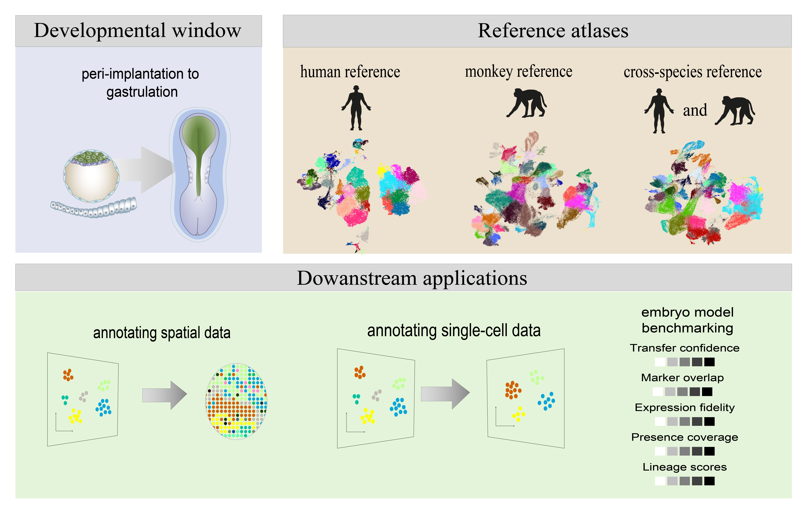

# Tools for Studying Embryonic Development

## Overview
This repository serves as a central portal for resources developed in this project, providing code to reproduce the results presented in the manuscript. This resource focuses on the critical peri-implantation to gastrulation period of human embryonic development, which is fundamental to understanding cell lineage specification and tissue formation. With the rapid advancement of stem-cell-based embryo models that mimic this stage *in vitro*, there is a growing need for well-curated, integrated post-implantation reference atlases. This project addresses that need by providing a comprehensive suite of tools.

## Highlights
- **Comprehensive Reference Atlases**:
  - Constructed integrated single-cell reference atlases for both **human** and **monkey** embryos.
  - The **human** and **monkey** cell atlases were integrated for comparative analyses.
- **Automated Cell Type Recognition**:
  - Developed and provided robust label transfer pipelines using the scPoli algorithm.
  - Trained robust models to enable automated and consistent cell type annotation for both single-cell and spatial transcriptomic datasets.
- **Benchmarking Framework**:
  - Created a curated benchmarking dataset comprising nine human embryo models.
  - Established quantitative metrics to evaluate the fidelity and developmental synchrony of *in vitro* embryo models.

## Applications
- Characterization and quality control of stem-cell-based embryo models.
- Evaluation of lineage specification and developmental synchrony.
- Automated annotation and integration of diverse transcriptomic datasets.

## Relevant Resources
 - The three reference cell atlases used in this study are publicly available through the China National GeneBank Database (CNGBdb) under the accession code [PRJCA045416](https://ngdc.cncb.ac.cn/gsa/browse/CRA012936). A dedicated repository for processed data can be accessed via [https://github.com/developmentalbiology/Post-implantation-developmental-reference](https://github.com/developmentalbiology/Post-implantation-developmental-reference).
 - The scDevelopment AI agent repository can be accessed via [https://github.com/developmentalbiology/scDevelopment-AI-agent](https://github.com/developmentalbiology/scDevelopment-AI-agent).

## Contact
If you have any questions, please create an issue or contact [fanxueying@westlake.edu.cn](mailto:fanxueying@westlake.edu.cn).
